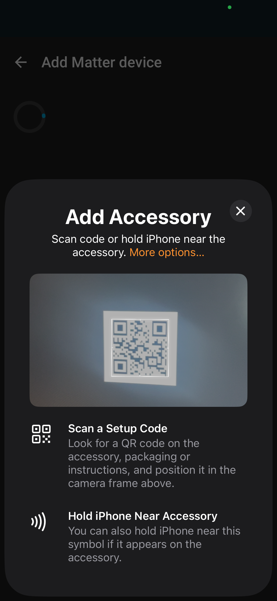
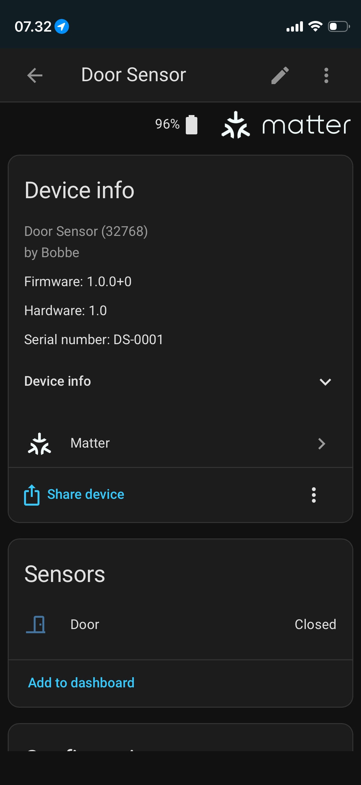

# Firmware

Firmware for [Matter over Thread Door Sensor](https://github.com/ThreadMatterDoorSensor/). Based on the [Contact sensor sample](https://docs.nordicsemi.com/bundle/ncs-3.2.0/page/nrf/samples/matter/contact_sensor/README.html), extended with a `PowerSource` cluster exposing `BatPercentRemaining`.

## Prerequisites

- [Nordic nRF Connect SDK 3.2.0](https://docs.nordicsemi.com/bundle/ncs-3.2.0/page/nrf/installation/install_ncs.html)
## Update west

```bash
west update
```

## Building

Default settings (can be overridden for any target):

```make
SERIAL        ?= DS-0001
DISCRIMINATOR ?= 0xA37
PASSCODE      ?= 71829304
```

### Debug (logging enabled)

```bash
cd application
make build-dk-debug
```

Override settings:

```bash
make build-dk-debug SERIAL=DS-0002 DISCRIMINATOR=0xB48 PASSCODE=98765432
```

### Production (logging disabled)

Logging is disabled to reduce power consumption on the battery-powered target PCB.

```bash
cd application
make build-dk
```

## Flash

Connect the nRF52840 DK via USB, then:

```bash
cd application
make flash-dk
```

## Add the Device to Home Assistant

To add the device in Home Assistant, install the Home Assistant Companion app. In Home Assistant, navigate to Settings, Devices & Services, Matter, then click Add Device and follow the pairing instructions.

|  |  |
|---|---|

Scan the QR code generated by the build system, located at `build/app/zephyr/factory_data.png`.
